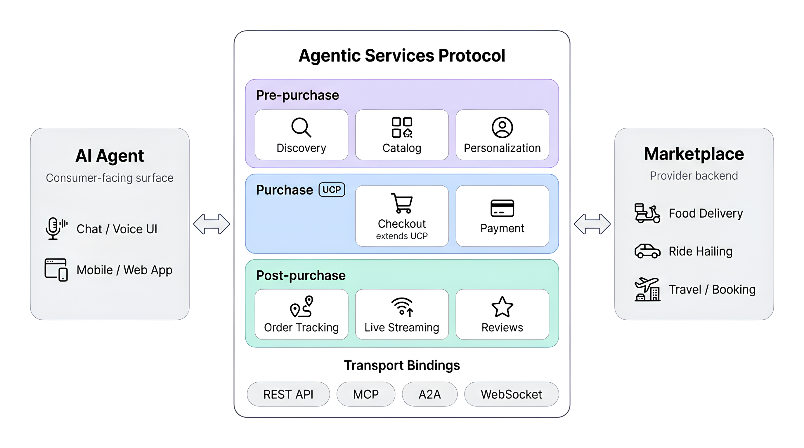

# Core Concepts

## Architecture Overview



## Capabilities vs Extensions

ASP defines two kinds of protocol additions:

**Capabilities** are standalone features that do not depend on UCP schemas:

- `dev.asp.services.discovery` — Provider search and filtering
- `dev.asp.services.catalog` — Extended catalogs with modifiers
- `dev.asp.services.personalization` — User profiles and promotions
- `dev.asp.services.reviews` — Post-service reviews and ratings

**Extensions** compose on top of existing UCP schemas using `allOf`:

- `dev.asp.services.fulfillment` — Extends `dev.ucp.shopping.checkout`
- `dev.asp.services.order_tracking` — Extends `dev.ucp.shopping.order`
- `dev.asp.services.streaming` — Extends `dev.asp.services.order_tracking`

Extensions declare an `extends` field pointing to the UCP capability they build upon.

## Discovery Profiles

Marketplaces declare their ASP support via a `/.well-known/asp` endpoint that returns a discovery profile:

```json
{
  "asp": {
    "version": "2026-02-19",
    "services": {
      "live_services": {
        "version": "2026-02-19",
        "rest": {
          "schema": "https://example.com/asp/openapi.yaml",
          "endpoint": "https://api.example.com/asp/v1"
        },
        "a2a": {
          "agentCard": "https://example.com/asp/a2a/agent-card.json",
          "endpoint": "https://api.example.com/asp/a2a"
        },
        "websocket": {
          "schema": "https://example.com/asp/asyncapi.yaml",
          "endpoint": "wss://api.example.com/asp/v1/ws"
        }
      }
    },
    "capabilities": [
      { "name": "dev.asp.services.discovery", "version": "2026-02-19" },
      { "name": "dev.asp.services.catalog", "version": "2026-02-19" },
      { "name": "dev.asp.services.fulfillment", "version": "2026-02-19", "extends": "dev.ucp.shopping.checkout" },
      { "name": "dev.asp.services.order_tracking", "version": "2026-02-19", "extends": "dev.ucp.shopping.order" },
      { "name": "dev.asp.services.personalization", "version": "2026-02-19" },
      { "name": "dev.asp.services.streaming", "version": "2026-02-19", "extends": "dev.asp.services.order_tracking" },
      { "name": "dev.asp.services.reviews", "version": "2026-02-19" }
    ]
  }
}
```

## Schema Composition

Extensions use JSON Schema's `allOf` to layer additional properties onto UCP schemas without replacing them:

```json
{
  "allOf": [
    { "$ref": "https://ucp.dev/schemas/shopping/checkout.json" },
    {
      "type": "object",
      "properties": {
        "fulfillment": { "$ref": "fulfillment.json" },
        "loyalty": { "$ref": "loyalty_discount.json" }
      }
    }
  ]
}
```

This means any UCP-compliant checkout remains valid — ASP adds optional fields alongside.

## Domain Profiles

ASP core schemas are vertical-agnostic. For vertical-specific specialization, **domain profiles** in `spec/schemas/domains/` constrain and extend core types using `allOf`:

- **Food Delivery** — Adds cuisine types, dietary restrictions
- **Ride-Hailing** — Adds vehicle categories, pickup/dropoff locations
- **Travel** — Adds accommodation categories, check-in/check-out dates

Domain profiles are reference examples, not required by the protocol.

## Transport Bindings

ASP schemas can be served over:

- **REST** — OpenAPI 3.1 binding with standard HTTP methods (request-response)
- **MCP** — Model Context Protocol for direct agent integration (tool-calling)
- **A2A** — Agent-to-Agent protocol for multi-step task delegation between agents
- **WebSocket** — AsyncAPI 3.0 binding for continuous live tracking (streaming)

| Transport | Spec File | Pattern | Use Case |
|---|---|---|---|
| REST | `openapi.yaml` | Request-response | Human apps, polling |
| MCP | `mcp_openrpc.json` | JSON-RPC tools | AI agent integration |
| A2A | `a2a_agent_card.json` | Task delegation | Agent-to-agent orchestration |
| WebSocket | `asyncapi.yaml` | Persistent stream | Live map tracking, real-time ETA |

All transport bindings live in `source/services/live_services/` and reference the same underlying ASP schemas. The WebSocket binding streams `tracking_stream_event` messages (location updates, status changes, heartbeats) over a persistent connection, enabling live delivery map rendering.

## Versioning

- **Protocol version**: `YYYY-MM-DD` format (e.g. `2026-02-19`)
- **Capability names**: Reverse-domain notation (e.g. `dev.asp.services.discovery`)
- **Backwards compatibility**: New optional fields can be added without a version bump. Required field changes or removals require a new version.

## Relationship to UCP

ASP orchestrates the full transaction lifecycle for live services — from discovering a provider through to post-order reviews. UCP handles the purchase step within that lifecycle: cart management, checkout, and payment.

| Phase | Protocol | Steps |
|---|---|---|
| **Pre-purchase** | ASP | Discovery, Catalog, Personalization |
| **Purchase** | UCP (with ASP Fulfillment extension) | Cart, Checkout, Payment |
| **Post-purchase** | ASP | Order Tracking, Live Streaming, Reviews |

ASP's extensions compose onto UCP schemas using `allOf`, so any UCP-compliant checkout remains valid. An agent that speaks both ASP and UCP can orchestrate a complete live service transaction end-to-end.
