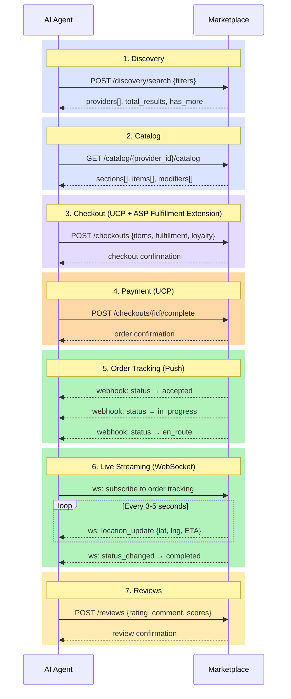

# Specification Overview

ASP defines **4 capabilities** and **3 extensions** that together cover the full transaction lifecycle for live services, incorporating UCP for cart, checkout, and payment.

## Protocol Components

### Capabilities (standalone)

| Capability | Identifier | Purpose |
|---|---|---|
| Discovery | `dev.asp.services.discovery` | Find providers by location, category, rating, availability |
| Catalog | `dev.asp.services.catalog` | Browse catalogs with sections, items, modifiers; reorder from history |
| Personalization | `dev.asp.services.personalization` | User profiles, order history, promotions |
| Reviews | `dev.asp.services.reviews` | Submit and retrieve post-service reviews and ratings |

### Extensions (compose on UCP)

| Extension | Identifier | Extends | Purpose |
|---|---|---|---|
| Fulfillment | `dev.asp.services.fulfillment` | `dev.ucp.shopping.checkout` | Fulfillment types, item customization, loyalty |
| Order Tracking | `dev.asp.services.order_tracking` | `dev.ucp.shopping.order` | Status progression, ETA, webhooks |
| Live Streaming | `dev.asp.services.streaming` | `dev.asp.services.order_tracking` | Continuous WebSocket location tracking |

## Transaction Flow

## Schema Files

All schemas live in `source/schemas/`:

- `asp.json`, `capability.json` — Meta schemas
- `services/shared/` — Shared types (money, postal_address, image)
- `services/types/` — Domain types (provider, catalog_item, fulfillment_status, etc.)
- `services/discovery.json` — Discovery capability
- `services/catalog.json` — Catalog capability
- `services/fulfillment.json` — Fulfillment extension
- `services/order_tracking.json` — Order tracking extension
- `services/streaming.json` — Live streaming extension
- `services/personalization.json` — Personalization capability
- `services/reviews.json` — Reviews capability
- `services/shared/pagination.json` — Shared pagination type

Published versions are generated to `spec/schemas/` via `python generate_schemas.py`.

## Domain Profiles

Optional vertical-specific schemas live in `source/schemas/domains/`:

- `food_delivery/` — Cuisine types, dietary restrictions, food-specific provider extensions
- `ride_hailing/` — Vehicle categories, ride fulfillment with pickup/dropoff
- `travel/` — Accommodation categories, booking fulfillment with check-in/out

Domain profiles use `allOf` to extend core types for a specific vertical. They are reference examples, not required by the protocol.
